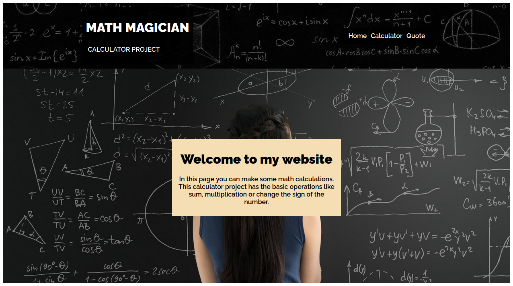
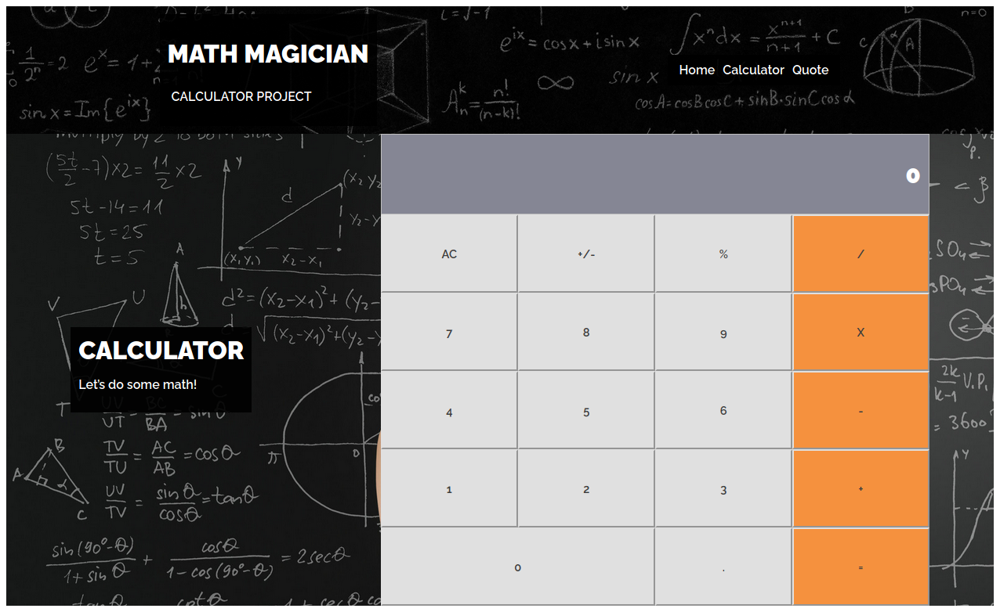

# Math Magician

This project was bootstrapped with [Create React App](https://github.com/facebook/create-react-app).

[![Contributors][contributors-shield]][contributors-url]
[![Forks][forks-shield]][forks-url]
[![Stargazers][stars-shield]][stars-url]
[![Issues][issues-shield]][issues-url]

<!-- PROJECT LOGO -->
  <h3 align="center">React Calculator</h3>

  <p align="center">
    This is a real world calculator designed with React, a JavaScript library for building user interfaces.<br /></p>
    
  <p align="center">
<a align="center" href="https://github.com/jessicafarias/calculator-react">
    
  </a>
  <a  href="https://github.com/jessicafarias/calculator-react">
    
  </a>
</p>

<!-- ABOUT THE PROJECT -->
## About The Project

This is a real world standard calculator used for series of mathematical operations. It is designed with React, a JavaScript library for building user interfaces.

## Live Demo
It's deployed [here](https://calculator-jess.herokuapp.com/) on heroku

### Built With
This project was built using these technologies.
* React
* JavaScript
* GitHub
* Eslint
* Stylelint
* VScode
* Jest


### Getting Started

To get a local copy up and running follow these simple example steps.

### Prerequisites

 * [Node.js](https://nodejs.org/) is required to install dependencies and run scripts via npm.
 * A modern browser

### Clone
* Clone this repo:
  - Clone with SSH:
  ```
    git@github.com:jessicafarias/React_Calculator.git
  ```
  - Clone with HTTPS
  ```
    https://github.com/jessicafarias/calculator-react.git
  ```
  - Clone with GitHub CLI
  ```
    gh repo clone jessicafarias/calculator-react
    
 - cd to React_Calculator


### Setup

Install dependencies:

```
$ npm install
```

Start the local webserver:

```$ npm start``` will open the calculator at local webserver at http://localhost:3000/ 


## Author

👤 **Jessica Michelle Farías Rosado**

## 📫 How to reach me:
 [](https://jessicafarias.github.io/)
 [](https://www.linkedin.com/in/jessica-michelle-farias-rosado/)
 [](mailto:jessica.farias.rosado@gmail.com)
 [](https://twitter.com/FariasRosado)

## 🤝 Contributing

Contributions, issues and feature requests are welcome!

Feel free to check the [issues page](https://github.com/jessicafarias/calculator-react/issues).

## Show your support

Give a :star: if you like this project!


<!-- MARKDOWN LINKS & IMAGES -->
<!-- https://www.markdownguide.org/basic-syntax/#reference-style-links -->
[contributors-shield]: https://img.shields.io/github/contributors/jessicafarias/calculator-react.svg?style=flat-square
[contributors-url]: https://github.com/jessicafarias/calculator-react/graphs/contributors
[forks-shield]: https://img.shields.io/github/forks/jessicafarias/calculator-react.svg?style=flat-square
[forks-url]: https://github.com/jessicafarias/calculator-react/network/members
[stars-shield]: https://img.shields.io/github/stars/jessicafarias/calculator-react.svg?style=flat-square
[stars-url]: https://github.com/jessicafarias/calculator-react/stargazers
[issues-shield]: https://img.shields.io/github/issues/jessicafarias/calculator-react.svg?style=flat-square
[issues-url]: https://github.com/jessicafarias/calculator-react/issues

## 📝 License

This project is [MIT](https://opensource.org/licenses/MIT) licensed.